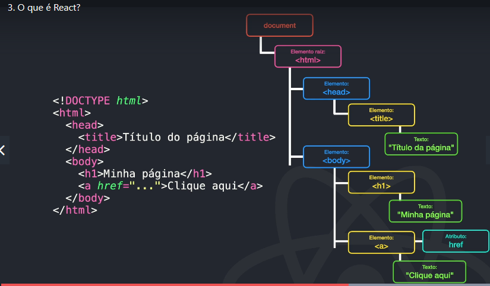

# React

## Definição:

- React é uma **biblioteca Javascript** declarativa, **eficiente e flexivel para criar interfaces** com o usuário.

No REACT criamos componentes que podem ser reutilizados na aplicção web.

- Document Object Model(DOM)

- O REACT trabalha com uma estrutura de componentes chamada de DOM virtual criado na memória, onde faz as alterações antes no Dom virtual para então renderizar o DOM da página. Isso facilita e deixa mais rápido.
