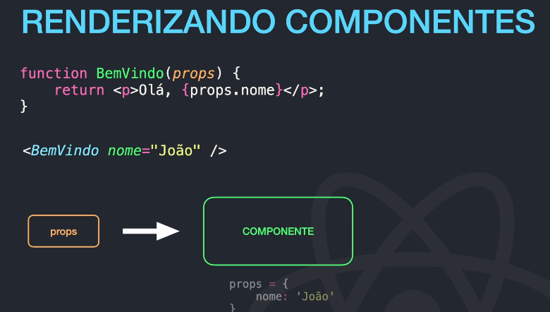
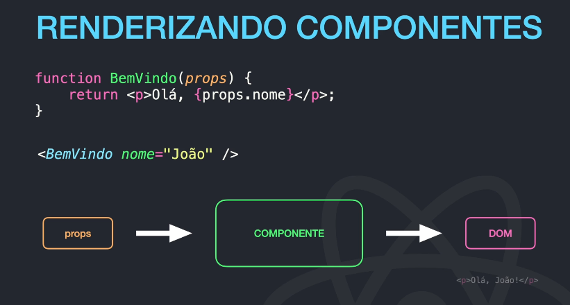
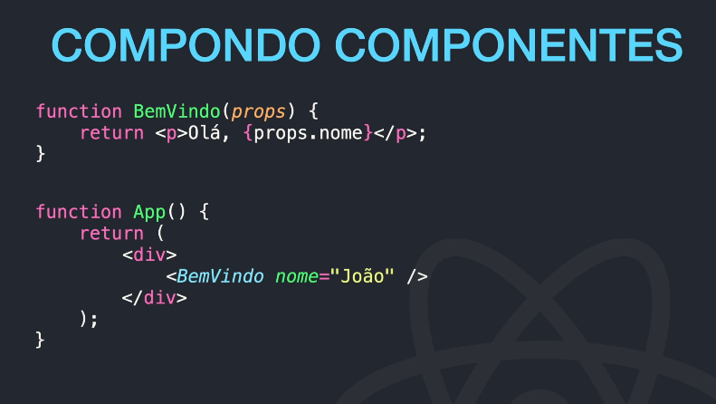
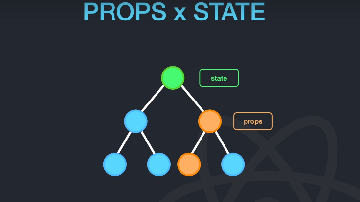

# React

## Principais conceitos

### JSX

- É uma extensão de sintaxe para Javascript.

```javascript
const elemento = <h1>Bom dia!</h1>;
```

```javascript
const nome = "João";
const elemento = <h1>Bom dia {nome}!</h1>;
```

```javascript
const data = <p>Compra feita em {formatarData(dataPedido)}</p>;
```

### Expressões em JSX

```javascript
function ola(usuario){
    if (usuario){
        return <h1>Olá, {formatarUsuario(usuario)}!</h1>;
    }
    retrun <h1>Olá, estranho...</h1>
}
```

### Atributos com JSX

- Há duas possibilidades: Aspas duplas ou chaves. Escolher uma das duas.

```javascript
const elemento = <div tabIndex="0">...</div>;
const elemento = ;
```

| HTML                | JSX                     |
| ------------------- | ----------------------- |
| tabindex = "0"      | tabIndex = "0"          |
| class = "meuEstilo" | className = "meuEstilo" |
| onclick = "..."     | onClick = "..."         |

- Em JSX sempre utilizar camelCase nas declarações.

### O que é um componente?

- Componentes permitem dividir a UI em partes independentes, reutilizáveis e pensar cada parte isoladamente

- Como uma função(componente de função):

```javascript
function BemVindo(props) {
  return <p>Olá, {props.nome}</p>;
}
```

- Como uma classe(componente de classe):

```javascript
class BemVindo extends React.Component {
  render() {
    <h1>Hello, {this.props.nome}</h1>;
  }
}
```

### Renderizando Componentes

```javascript
function BemVindo(props) {
  return <p>Olá, {props.nome}</p>;
}

<BemVindo nome="João" />;
```






As propriedades de um componente são somente leitura.

Podemos utilizar um componente dentro de outro componente.



### PROPS X STATE


No DOM virtual manipulamos componentes com props.

