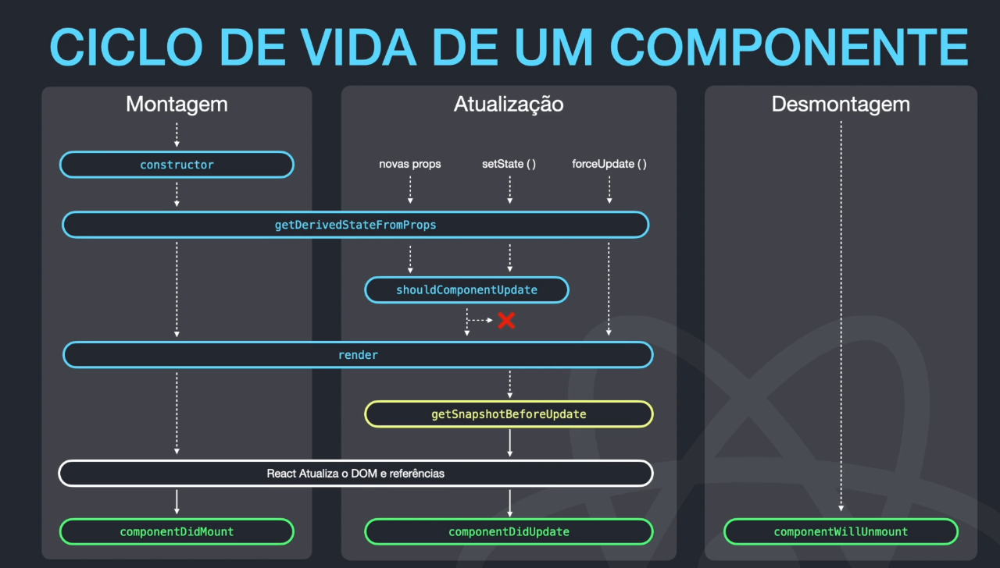
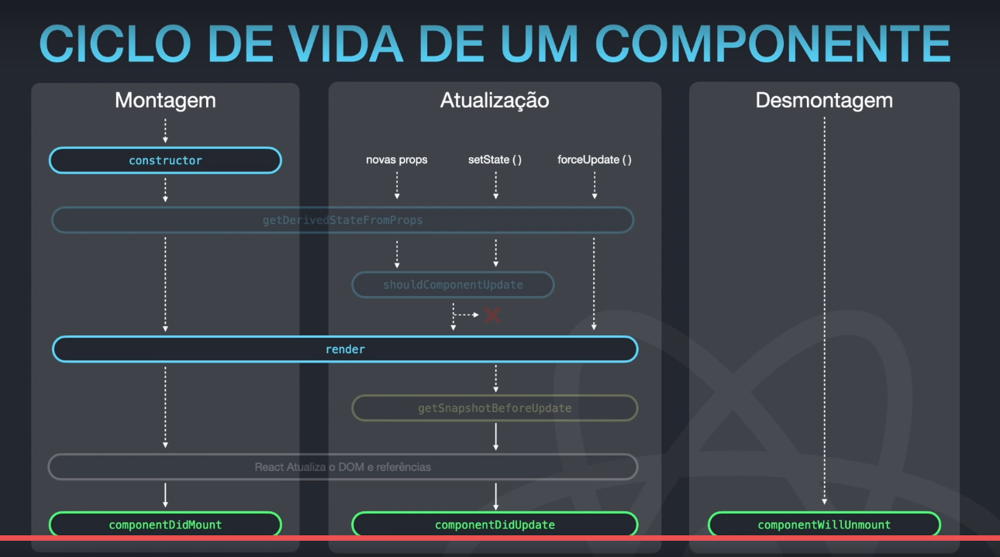

# Ciclo de vida de um componente no REACT

## Ciclos

    - montagem, atualização, desmontagem
    - ordem dos métodos montagem: constructor -> getDerivedStateFromProps(raramente usado) -> render(converte o jsx) -> react atualiza o DOM -> componentDidMount(fazer chamada ajax aqui/carregar api)
    - ordem dos métodos Atualização: novas props/setState() -> getDerivedStateFromProps(raramente usado) -> shouldComponentUpdate ->render(converte o jsx) -> react atualiza o DOM -> componentDidUpdate(fazer chamada ajax aqui/carregar api)
    - ordem dos métodos Desmontagem: componentWillUnmount
    - Métodos em azul podem ser pausados, reinicializados sem efeitos colaterais;
    - Métodos em amarelo é o único que pode ler o DOM;
    - Métodos em verde podem operar o DOM;

## Métodos mais utilizados

